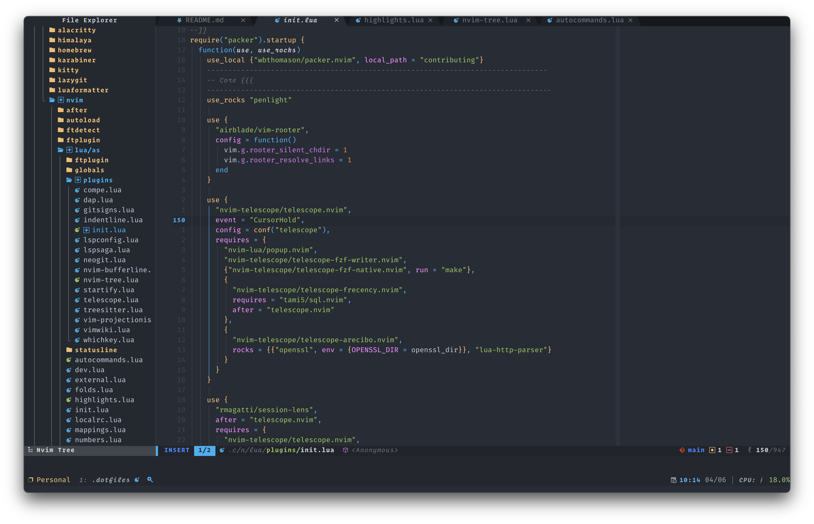

# .dotfiles



My dotfiles including _zsh_, _(n)vim_ and _tmux_ config files (stashed away in case of laptop armageddon).

I thought I'd document for myself and for others potentially some of the setup
involved in the various programs my dotfiles cover.

### Installation

```
curl -s https://raw.githubusercontent.com/akinsho/dotfiles/master/install.sh | bash
```

### Highlights / Tools

- [Kitty](https://sw.kovidgoyal.net/kitty/index.html)/[Alacritty](https://github.com/alacritty/alacritty) GPU accelerated terminal emulators
- [Nvim (nightly)](https://github.com/neovim/neovim)
- Language server support using [`coc.nvim`](https://github.com/neoclide/coc.nvim)

- Minimal Zsh config without `oh-my-zsh`, async prompt for really large monorepos.

  

Feel free to copy and paste as needed, but I _strongly_ advise against cloning this repo.
It wasn't designed to be used in that way 🤷.

### Setup

Setup is managed using [dotbot](https://github.com/anishathalye/dotbot). To setup symlinks run
`./install` in the root directory of the repository

NOTE: I've symlinked the (n)vim directory to `$HOME/config/nvim`.

### Structure

After struggling with a 2500+ line long `init.vim`. Which I personally found quite difficult to navigate
and reason about. I decided to modularise my `init.vim`.

Having taken a look at several patterns online I decided on the following approach.
My `init.vim` is essentially a hub of links to the various sections of my configuration.

These are divided into:

- autocommands
- mappings
- general settings
- plugins (home made or stolen vim script)

Specific configurations for plugins I've used/am using are in the `plugin` directory as `<plugin-name>.vim`.
All vim files in this are sourced, but they all include a check to see if the particular plugin is loaded
first (currently hard coded within each file).

I tend to keep all configuration around as I often change my mind
about plugins and some of these settings took ages to find and are usually set to exactly what I want from that
plugin and I'd rather not delete these and have to figure it all out again

Filetype specific overrides and settings where possible are in `ftplugin` files in the after directory.
Slightly beefier bits of functionality I use on an adhoc basis are in the autoload directory.
